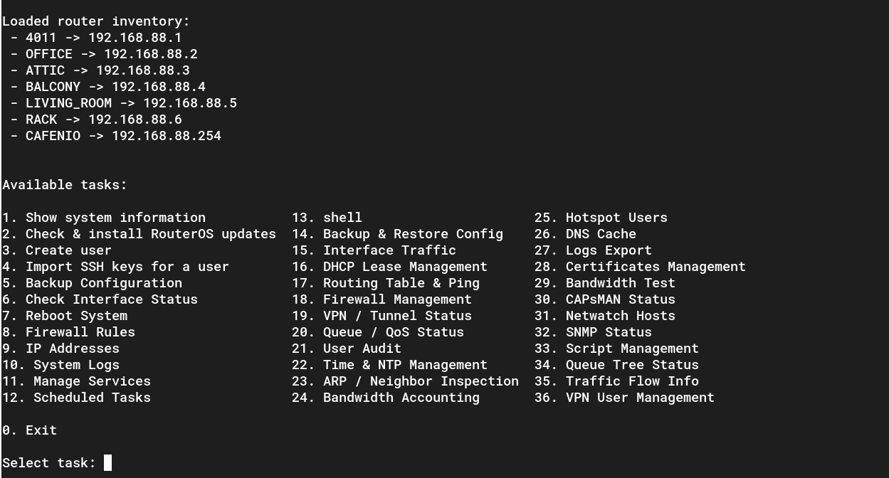

# MikroTik SSH Management Tool

A Python CLI application to manage MikroTik routers via SSH.  
It supports tasks such as system info retrieval, user management, firewall and service control, backups, VPN status, interface monitoring, DHCP leases, and more.



---

## Features

- Connect to multiple MikroTik routers via SSH.
- Run tasks interactively on selected routers.
- Tasks include:
  - System info and resources
  - Package updates
  - User creation and audit
  - Firewall and service management
  - Interface and queue status
  - Backups and restores
  - DHCP lease management
  - VPN status monitoring
- Extensible task registry for easy task addition.
- Configurable via environment variables or `.env` file.
- Optional dry-run mode for testing.

---

## Requirements

- Python 3.12+
- pip dependencies:
- python-dotenv
- librouteros

---

## Project Structure
```bash
mikrotik-ops/
├── client.py					  # Router API wrapper
├── config.py				      # Env & configuration
├── dockerfile
├── main.py					      # CLI entrypoint
├── README.md
├── registry.py				      # Task registry
├── requirements.txt
├── routers.py				      # Router client management
├── tasks					      # Task implementations
│   ├── __init__.py
│   ├── misc1_2.py
│   ├── misc13_23.py
│   ├── misc24_34.py
│   └── misc3_13.py
└── ui.py					      # CLI UI helpers
```

---

##Setup
1. Clone the repository:
```bash
git clone https://github.com/funmicra/mikrotik-ops.git
cd mikrotik-ops
```

2. Create a virtual environment:

```bash
python3 -m venv venv
source venv/bin/activate
```

3. Install dependencies:

```bash
pip install -r requirements.txt
```

4. Rename .env.examle and modify with your router credentials and settings:

```env
# Global credentials
MT_USERNAME=username
MT_PASSWORD=supersecretpassword
MT_SSH_KEY=/path/to/private/ssh/key
MT_SSH_PORT=22

# Routers (comma-separated)
MT_ROUTERS=core,edge,office,lab1,lab2,backup

# Router IPs
MT_ROUTER_CORE=192.168.88.1
MT_ROUTER_EDGE=192.168.88.2
MT_ROUTER_OFFICE=192.168.88.3
MT_ROUTER_LAB1=192.168.88.4
MT_ROUTER_LAB2=192.168.88.5
MT_ROUTER_BACKUP=192.168.88.6

# Runtime behavior
DRY_RUN=true
LOG_LEVEL=INFO
```
---

## Usage
Run the CLI application:
```bash
python3 main.py
```

Follow the interactive menu to:

- Select routers

- Choose tasks

- Execute actions

---

## Docker

You can run the app inside Docker:
```dockerfile
# Use official Python image
FROM python:3.12-slim

# Set workdir
WORKDIR /app

# Copy requirements first for caching
COPY requirements.txt .

# Install dependencies
RUN pip install --no-cache-dir -r requirements.txt

# Copy the rest of the app
COPY . .

# Expose port if needed (not mandatory for CLI)
# EXPOSE 22

# Default command
CMD ["python", "main.py"]
```
Build and run:

```bash
docker build -t mikrotik-app .
docker run --env-file .env -it mikrotik-app
```
---
## Extending Tasks

- Tasks are registered in registry.py.

- Each task is a function in tasks/ modules.

- Add a new task function and register it in TASKS with a descriptive name.